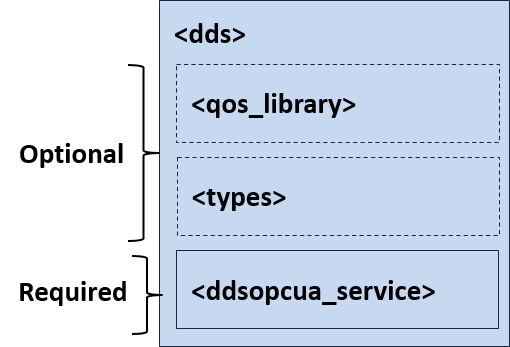
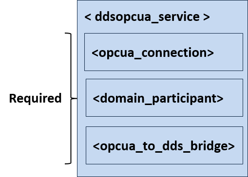

.. include:: vars.rst

.. _section-configuration:

Configuration
=============

When you start the *OPC UA/DDS Gateway*, you can specify a configuration file
in XML format.  In that file, you can set properties that control the behavior
of the service and the corresponding mappings. This section describes how to
write a configuration file.

.. _section-how-to-load-the-xml-configuration:

How to Load the XML Configuration
---------------------------------

The *OPC UA/DDS Gateway* loads its XML configuration from multiple locations.
Here are the various sources of configuration files, listed in load order:

- ``<working directory>/USER_RTI_DDS_OPCUA_SERVICE.xml``
  This file is loaded automatically if it exists.
- ``<DDSOPCUA_HOME>/resources/xml/RTI_DDS_OPCUA_SERVICE.xml``
  This file is loaded automatically if it exists.
- File specified using the command-line parameter ``-cfgFile``.

.. note::

    - ``<working directory>`` indicates the path to the current working
      directory from which you run the *OPC UA/DDS Gateway*.
    - ``<DDSOPCUA_HOME>`` indicates the path to your *Connext DDS* installation.
      See :numref:`section-path-mentioned-in-documentation`.

You may use a combination of the above sources and load multiple
configuration files.

Here is an example configuration file.  You will learn the meaning of
each line as you read the rest of this section.

.. code-block:: xml
    :linenos:

    <dds xmlns:xsi="http://www.w3.org/2001/XMLSchema-instance"
        xsi:noNamespaceSchemaLocation="../schema/rti_dds_opcua_service.xsd">
        <types>
            <struct name="ScalarTypes">
                <member name="my_int16" type="int16"/>
                <member name="my_uint16" type="uint16"/>
            </struct>
        </types>
        <ddsopcua_service name="default">
            <opcua_connection name="MyServerConnection"
                              server_endpoint_url="opc.tcp://127.0.0.1:4840">
                <timeout>5000</timeout>
            </opcua_connection>

            <domain_participant name="MyDomainParticipant" domain_id="0" >
                <register_type name="ScalarTypes" type_ref="ScalarTypes" />
            </domain_participant>

            <opcua_to_dds_bridge name="MyDds2OpcUaBridge">
                <subscription name="MySubscription">
                    <opcua_input name="MyInput"
                                 opcua_connection_ref="MyServerConnection">
                        <subscription_protocol>
                            <requested_publishing_interval>10</requested_publishing_interval>
                            <publishing_enabled>true</publishing_enabled>
                        </subscription_protocol>
                        <monitored_items>
                            <node_attribute dds_topic_field_name="my_int16">
                                <node_id>
                                    <namespace_index>1</namespace_index>
                                    <numeric_identifier>51004</numeric_identifier>
                                </node_id>
                                <attribute_id>VALUE</attribute_id>
                            </node_attribute>
                            <node_attribute dds_topic_field_name="my_uint16">
                                <node_id>
                                    <namespace_index>1</namespace_index>
                                    <numeric_identifier>51005</numeric_identifier>
                                </node_id>
                                <attribute_id>VALUE</attribute_id>
                            </node_attribute>
                        </monitored_items>
                    </opcua_input>
                    <dds_output name="MyOutput"
                                domain_participant_ref="MyDomainParticipant">
                        <topic_name>ScalarTypesTopic</topic_name>
                        <registered_type_name>ScalarTypes</registered_type_name>
                    </dds_output>
                </subscription>
            </opcua_to_dds_bridge>
        </ddsopcua_service>
    </dds>

XML Syntax and Validation
-------------------------

The XML representation of DDS-related resources must follow these syntax
rules:

-  It shall be a well-formed XML document according to the criteria
   defined in clause 2.1 of
   :link_xml_spec:`the Extensible Markup Language standard <>`.
-  It shall use UTF-8 character encoding for XML elements and values.
-  It shall use ``<dds>`` as the root tag of every document.

To validate the loaded configuration, the *OPC UA/DDS Gateway* relies on an XSD
file that describes the format of the XML content. We recommend
including a reference to this document in the XML file that contains the
service’s configuration; this document provides helpful features in code
editors such as Visual Studio®, Eclipse®, and NetBeans®, including
validation and auto-completion while you are editing the XML file.

The XSD definitions of the XML elements are in
``$DDSOPCUA_HOME/resources/schema/rti_dds_opcua_service.xsd``.

To include a reference to the XSD document in your XML file, use the
attribute ``xsi:noNamespaceSchemaLocation`` in the ``<dds>`` tag. For example:

.. code-block:: xml
   :linenos:
   :emphasize-lines: 3

   <?xml version="1.0" encoding="UTF-8"?>
   <dds xmlns:xsi="http://www.w3.org/2001/XMLSchema-instance"
      xsi:noNamespaceSchemaLocation="<DDSOPCUA_HOME>/resources/schema/rti_dds_opcua_service.xsd">
      <!-- ... -->
   </dds>

.. note::

    ``<DDSOPCUA_HOME>`` indicates the path to your *Connext DDS* installation.
    See :numref:`section-path-mentioned-in-documentation`.

.. _section-config-XML-tags:

XML Tags for Configuring the OPC UA/DDS Gateway
-----------------------------------------------

This section describes the XML tags you can use in an *OPC UA/DDS Gateway*
configuration file. The following diagram and table describe the top-level
tags allowed within the root ``<dds>`` tag.

    Top-level Tags in OPC UA/DDS Gateways's Configuration File

.. list-table:: Top-level Tags in OPC UA/DDS Gateway's Configuration File
    :name: TableTopLevelTag
    :widths: 25 60 15
    :header-rows: 1
    :class: longtable

    * - Tags within :litrep:`<dds>`
      - Description
      - Multiplicity
    * - :litrep:`<qos_library>`
      - Specifies a QoS library and profiles. The contents of this tag are
        specified in the same manner as for the *Connext DDS* QoS profile
        file—see
        :link_xml_qos_config:`Configuring QoS with XML in the RTI Connext
        DDS Core Libraries User's Manual <>`.
      - 0..*
    * - :litrep:`<types>`
      - Defines types that can be used by *OPC UA/DDS Gateway*.
        The type description is done using the *Connext DDS* XML format for
        type definitions.
        See :link_userman_types_in_xml:`Creating User Data Types with
        Extensible Markup Language (XML), in the RTI Connext DDS
        Core Libraries User's Manual <>`.
      - 0..*
    * - :litrep:`<ddsopcua_service>`
      - **Required.** |br|
        Specifies an *OPC UA/DDS Gateway* configuration.
        See :numref:`section-config-ddsopcua-service-tag`.

        Attributes
            - ``name``: Uniquely identifies an *OPC UA/DDS Gateway* configuration.
              **Required**.

        Example
            .. code-block:: xml

                <ddsopcua_service name="default">
                    <!-- Your Gateway settings ... -->
                </ddsopcua_service>

      - 1..*

.. _section-config-ddsopcua-service-tag:

Gateway Service Tag
-------------------

A configuration file must have at least one ``<ddsopcua_service>`` tag.
This tag is used to configure an execution of the *OPC UA/DDS Gateway*.

A configuration file may contain multiple ``<ddsopcua_service>`` tags.
When you start the *OPC UA/DDS Gateway*, you can use the ``-cfgName``
command-line parameter to specify which ``<ddsopcua_service>`` tag to use
to configure the Gateway. This means one file can be used to configure multiple
*OPC UA/DDS Gateway* executions.

The following diagram describes the tags allowed within a
``<ddsopcua_service>`` tag.

    Tags used to configure an *OPC UA/DDS Gateway* instance.

.. list-table:: Service Tags in OPC UA/DDS Gateway's Configuration File
    :name: TableServiceTag
    :widths: 30 55 15
    :header-rows: 1
    :class: longtable

    * - Tags within :litrep:`<ddsopcua_service>`
      - Description
      - Multiplicity
    * - :litrep:`<opcua_connection>`
      - **Required**. |br|
        Defines a connection of the *OPC UA/DDS Gateway* to an external OPC UA
        Server. This connection may be instantiated by an OPC UA Input mapped
        to a DDS Output.

        Attributes
            - ``name``: Uniquely identifies an OPC UA Connection. **Required**.
            - ``server_endpoint_url``: Endpoint URL of the remote OPC UA Server
              the connection must established with. **Required**.

        Example
            .. code-block:: xml

                <opcua_connection name="MyServerConnection"
                                  server_endpoint_url="opc.tcp://127.0.0.1:4840">
                    <timeout>5000</timeout>
                </opcua_connection>

        See :numref:`section-config-opcua-connection-tag`.
      - 1
    * - :litrep:`<domain_participant>`
      - **Required**. |br|
        Specifies a DomainParticipant to use in the communication with the
        DDS Global Data Space. DomainParticipants are responsible for creating
        all the endpoints required.

        Attributes
            - ``name``: Uniquely identifies a DomainParticipant. **Required**.

        Example
            .. code-block:: xml

                <domain_participant name="MyParticipant" domain_id="0">
                    <!-- Participant QoS -->
                    <!-- Register Types -->
                </domain_participant>

        See :numref:`section-config-domainparticipant-tag`.
      - 1
    * - :litrep:`<opcua_to_dds_bridge>`
      - **Required**. |br|
        Defines an OPC UA to DDS Bridge that can be used to define OPC UA
        Subscriptions (opcua_inputs) and map them to DDS Publications
        (dds_outputs) accordingly.

        Attributes
            - ``name``: OPC UA to DDS bridge name. **Required**.

        Example
            .. code-block:: xml

              <opcua_to_dds_bridge name="MyDds2OpcUaBridge">
                  <!-- ... -->
              </opcua_to_dds_bridge>

        See :numref:`section-opcua_to_dds_bridge-tag`.
      - 1

Example:  Specify an OPC UA/DDS Gateway Configuration in XML
^^^^^^^^^^^^^^^^^^^^^^^^^^^^^^^^^^^^^^^^^^^^^^^^^^^^^^^^^^^^

.. code-block:: xml

    <dds>
        <types>
            <!-- ... -->
        </types>
        <ddsopcua_service name="MyOpcUaService">
            <!-- ... -->
        </ddsopcua_service>
    </dds>

Starting an *OPC UA/DDS Gateway* instance with the following command will use
the ``<ddsopcua_service>`` tag with the name "MyOpcUaService":

.. code-block:: console

    $ $DDSOPCUA_HOME/bin/rtiddsopcuagateway -cfgFile file.xml -cfgName MyOpcUaService

.. _section-config-opcua-connection-tag:

OPC UA Connection Tag
---------------------

.. list-table:: OPC UA Connection Tags in an *OPC UA/DDS Gateway*'s Configuration File
    :name: TableOPCUAConnectionTag
    :widths: 30 55 15
    :header-rows: 1
    :class: longtable

    * - Tags within :litrep:`<opcua_connection>`
      - Description
      - Multiplicity
    * - :litrep:`<timeout>`
      - Configures the timeout for the application session with the OPC UA
        server in milliseconds.
      - 0..1
    * - :litrep:`<secure_channel_lifetime>`
      - Configures the lifetime of the secure channel with the OPC UA server
        in milliseconds.
      - 0..1

.. _section-config-domainparticipant-tag:

DomainParticipant Tag
---------------------

.. list-table:: DomainParticipant Tags in an *OPC UA/DDS Gateway*'s Configuration File
    :name: TableDomainParticipantTag
    :widths: 30 55 15
    :header-rows: 1
    :class: longtable

    * - Tags within :litrep:`<domain_participant>`
      - Description
      - Multiplicity
    * - :litrep:`<domain_id>`
      - **Required**. |br|
        DDS domain ID used to communicate with DDS applications.
      - 1
    * - :litrep:`<participant_qos>`
      - QoS used by this DomainParticipant.
        See :link_xml_qos_config:`Configuring QoS with XML, in the RTI Connext
        DDS Core Libraries User's Manual <>`.
      - 0..1
    * - :litrep:`<register_type>`
      - Registers a type name and associates it with a type representation.
        When you define a type in the configuration file, you have to
        register the type in order to use it in a ``<topic>``.
      - 0..*

.. _section-opcua_to_dds_bridge-tag:

OPC UA to DDS Bridge Tag
------------------------

.. list-table:: OPC UA to DDS Bridge tags in an OPC UA/DDS Gateway's Configuration File
    :name: TableOPCUAToDDSBridgeTag
    :widths: 30 55 15
    :header-rows: 1
    :class: longtable

    * - Tags within :litrep:`<opcua_to_dds_bridge>`
      - Description
      - Multiplicity
    * - :litrep:`<service_set>`
      - Exposes DDS applications to a subset of the OPC UA Service Set of
        an OPC UA Server.

        Attributes
            - ``opcua_connection_ref``: Identifies the OPC UA Server to
              expose. **Required**.
            - ``domain_participant_ref``: Identifies the DomainParticipant that
              will **Required**.

        Example
            .. code-block:: xml

                <opcua_to_dds_bridge name="MyDds2OpcUaBridge">
                    <service_set opcua_connection_ref="MyServerConnection"
                                 domain_participant_ref="MyDomainParticipant">
                        <!-- ... -->
                    </service_set>
                </opcua_connection>

        See :numref:`section-service-set-tag`.
      - 0..1

    * - :litrep:`<subscription>`
      - Configures a Subscription that maps an OPC UA Input (an OPC UA
        Subscription to a set of multiple monitored items) to a DDS Output (a
        DDS Topic).

        Attributes
            - ``name``: Uniquely identifies a Subscription. **Required**.

        Example
            .. code-block:: xml

                <opcua_to_dds_bridge name="MyDds2OpcUaBridge">
                    <subscription name="MySubscription">
                        <!-- ... -->
                    </subscription>
                </opcua_connection>

        See :numref:`section-subscription-tag`.
      - 0..*

    * - :litrep:`<publication>`
      - Configures a Publication that maps a DDS Input (a DDS Topic) to an
        OPC UA Output (a set of Variable Nodes in the address space of an OPC
        UA Server).

        Attributes
            - ``name``: Uniquely identifies a Publication. **Required**.

        Example
            .. code-block:: xml

                <opcua_to_dds_bridge name="MyDds2OpcUaBridge">
                    <publication name="MyPublication">
                        <!-- ... -->
                    </publication>
                </opcua_connection>

        See :numref:`section-subscription-tag`.
      - 0..*

    * - :litrep:`<publisher_qos>`
      - Configures the Publisher QoS of the DDS Publisher for every DDS
        DataWriter associated with a DDS Output within the OPC UA to DDS Bridge.
      - 0..1

    * - :litrep:`<subscriber_qos>`
      - Configures the Subscriber QoS of the DDS Subscriber for every DDS
        DataReader associated with a DDS Input within the OPC UA to DDS Bridge.
      - 0..1

.. _section-service-set-tag:

ServiceSet Tag
--------------

.. list-table:: Service Set Configuration in the Context of an OPC UA to DDS Bridge Configuration File
    :name: TableServiceSetTag
    :widths: 30 55 15
    :header-rows: 1
    :class: longtable

    * - Tags within :litrep:`<service_set>`
      - Description
      - Multiplicity
    * - :litrep:`<attribute_service_set>`
      - **Required**. |br|
        Enables or disables the Attribute Service Set. This Service Set allows
        remote requesters to perform read and write opertions on the remote
        OPC UA Server through the *OPC UA/DDS Gateway*.

        Example
            .. code-block:: xml

                <service_set opcua_connection_ref="MyServerConnection"
                             domain_participant_ref="MyDomainParticipant">
                    <attribute_service_set>
                        <enabled>true</enabled>
                    </attribute_service_set>
                </service_set>

      - 1

.. _section-subscription-tag:

Subscription Tag
----------------

.. list-table:: Subscription Configuration in the Context of an OPC UA to DDS Bridge Configuration File
    :name: TableSubscriptionTag
    :widths: 30 55 15
    :header-rows: 1
    :class: longtable

    * - Tags within :litrep:`<subscription>`
      - Description
      - Multiplicity
    * - :litrep:`<opcua_input>`
      - **Required**. |br|
        Configures an OPC UA Subscription to monitor data items in the address
        space of an OPC UA Server.

        Attributes
            - ``name``: Uniquely identifies an OPC UA Input. **Required**.
            - ``opcua_connection_ref``: Name of the OPC UA Connection where the
              Subscription will be created. **Required**.

        Example
            .. code-block:: xml

                <subscription name="MySubscription">
                    <opcua_input name="MyInput"
                                 opcua_connection_ref="MyServerConnection">
                        <!-- ... -->
                    </opcua_input>
                    <dds_output></dds_output>
                </subscription>

        See :numref:`section-opcua-input-tag`.
      - 1
    * - :litrep:`<dds_output>`
      - **Required**. |br|
        Configures the DDS *Topic* that will be used to propagate information
        changes in the list of monitored items of the OPC UA Input.
        DDS Outputs configure also the QoS Policies associated with the internal
        DDS *DataWriter* that publishes updates to that *Topic*.

        Attributes
            - ``name``: Uniquely identifies a DDS Output. **Required**.
            - ``domain_participant_ref``: Name of the DDS
              *DomainParticipant* that will instantiate the DDS *Topic* and
              internal *DataWriter*. **Required**.

        Example
            .. code-block:: xml

                <subscription name="MySubscription">
                    <opcua_input></opcua_input>
                    <dds_output name="MyOutput"
                                domain_participant_ref="MyDomainParticipant">
                        <!-- ... -->
                    </dds_output>
                </subscription>

        See :numref:`section-dds-output-tag`.
      - 1

.. _section-opcua-input-tag:

OPC UA Input Tag
^^^^^^^^^^^^^^^^

.. list-table:: OPC UA Input Configuration in the Context of a Subscription
    :name: TableOpcUaInputTag
    :widths: 30 55 15
    :header-rows: 1
    :class: longtable

    * - Tags within :litrep:`<opcua_input>`
      - Description
      - Multiplicity
    * - :litrep:`<subscription_protocol>`
      - **Optional**. |br|
        Configures the OPC UA Subscription used by the OPC UA Input.

        Example
            .. code-block:: xml

                <opcua_input name="MyInput">
                    <subscription_protocol>
                        <requested_publishing_interval>
                            10
                        </requested_publishing_interval>
                        <requested_lifetime_count>
                            3000
                        </requested_lifetime_count>
                        <requested_max_keep_alive_count>
                            1000
                        </requested_max_keep_alive_count>
                        <max_notifications_per_publish>
                            1
                        </max_notifications_per_publish>
                        <publishing_enabled>
                            true
                        </publishing_enabled>
                        <priority>
                            1
                        </priority>
                    </subscription_protocol>
                    <!-- ... -->
                </opcua_input>

      - 0..1
    * - :litrep:`<monitored_items>`
      - **Required**. |br|
        Adds MonitoredItems to the OPC UA Subscription.

        Example
            .. code-block:: xml

                <opcua_input name="MyInput">
                    <monitored_items>
                        <node_attribute></node_attribute>
                        <!-- ... -->
                        <node_attribute></node_attribute>
                    </monitored_items>
                </opcua_input>

        See :numref:`section-data-item-tag`.
      - 1

.. _section-data-item-tag:

Monitored Items Tag
"""""""""""""""""""

:numref:`TableMonitoredNodeAttributeTag` describes the tags allowed within
``<monitored_items>``.

.. list-table:: MonitoredItems Tag Configuration
    :name: TableMonitoredItemsTag
    :widths: 30 55 15
    :header-rows: 1
    :class: longtable

    * - Tags within :litrep:`<monitored_items>`
      - Description
      - Multiplicity
    * - :litrep:`<node_attribute>`
      - **Required**. |br|
        Provides a list of Node Attributes to monitor in the remote OPC UA
        Server and maps each attribute to one of the fields of the DDS *Topic*
        associated with the DDS Output.

        Attributes
            - ``dds_topic_field_name``: Fully-qualified name of the DDS
              *Topic* field to which the *Gateway* must assign the updated Node
              Attribute upon the reception of a notification message.

              The fully-qualified name of a nested field must be provided using
              a dot-separated notation; for instance,
              ``"<grandparent_field><parent_field>.<child_field>"``. The
              notation allows accessing individual array or sequence elements as
              follows: ``"<parent_field>.<child_field>[<index>]"``. **Required**.

        Example
            .. code-block:: xml

                <opcua_input name="MyOutput">
                    <monitored_items>
                        <node_attribute dds_topic_field_name="my_boolean">
                            <!-- ... -->
                        </node_attribute>
                        <node_attribute dds_topic_field_name="my_string">
                            <!-- ... -->
                        </node_attribute>
                    </monitored_items>
                </opcua_input>

      - 1

:numref:`TableMonitoredNodeAttributeTag` describes the tags allowed within each
``<node_attribute>`` of the ``<monitored_items>`` list.

.. list-table:: Monitored Node Attribute Configuration
    :name: TableMonitoredNodeAttributeTag
    :widths: 25 60 15
    :header-rows: 1
    :class: longtable

    * - Tags within :litrep:`<node_attribute>`
      - Description
      - Multiplicity
    * - :litrep:`<node_id>`
      - **Required**. |br|
        Provides the Node ID of the node attribute to be monitored. Every Node
        ID is composed of ``<namespace_index>`` and an identifier, which can be
        either a ``<numeric_identifier>`` or a ``<string_identifier>``.

        Example
            .. code-block:: xml

                <monitored_items>
                    <node_attribute dds_topic_field_name="my_boolean">
                        <node_id>
                            <namespace_index>1</namespace_index>
                            <numeric_identifier>51001</numeric_identifier>
                        </node_id>
                        <!-- ... -->
                    </node_attribute>
                    <node_attribute dds_topic_field_name="my_int32">
                        <node_id>
                            <namespace_index>2</namespace_index>
                            <numeric_identifier>Demo.Scalar.Int32</numeric_identifier>
                        </node_id>
                        <!-- ... -->
                    </node_attribute>
                </monitored_items>
      - 1
    * - :litrep:`<attribute_id>`
      - **Required**. |br|
        Identifies the attribute to be accessed and evaluated, which is usually
        the ``VALUE`` attribute.

        Example
            .. code-block:: xml

                <node_attribute dds_topic_field_name="my_boolean">
                    <node_id>
                        <namespace_index>1</namespace_index>
                        <numeric_identifier>51001</numeric_identifier>
                    </node_id>
                    <attribute_id>VALUE</attribute_id>
                </node_attribute>

      - 1
    * - :litrep:`<sampling_interval>`
      - **Optional**. |br|
        Specifies the fastest rate in milliseconds at which the MonitoredItem
        should be accessed and evaluated.
      - 0..1
    * - :litrep:`<queue_size>`
      - **Optional**. |br|
        Requested size of the MonitoredItem queue.
      - 0..1
    * - :litrep:`<discard_oldest>`
      - **Optional**. |br|
        A boolean parameter indicating whether the oldest notification in the
        queue is discarded when the queue is full. If false, the last added
        Notification gets replaced with the newest.
      - 0..1

.. _section-dds-output-tag:

DDS Output Tag
^^^^^^^^^^^^^^

:numref:`TableDdsOutputTag` describes the tags allowed within a
``<dds_output>`` tag.

.. list-table:: DDS Output Configuration in the Context of a Subscription
    :name: TableDdsOutputTag
    :widths: 30 55 15
    :header-rows: 1
    :class: longtable

    * - Tags within :litrep:`<dds_output>`
      - Description
      - Multiplicity
    * - :litrep:`<topic_name>`
      - **Required**. |br|
        Configures the name of the DDS *Topic* that will be published by the DDS Output.
      - 1
    * - :litrep:`<registered_type_name>`
      - **Required**. |br|
        Name of the registered type associated with the DDS Topic. This type must
        have been previously registered with the DDS *DomainParticipant*
        referred by the DDS Output.
      - 1
    * - :litrep:`<datawriter_qos>`
      - **Optional**. |br|
        QoS settings for the DDS DataWriter associated with the DDS Output.
      - 0..1

Example DDS Output Configuration
""""""""""""""""""""""""""""""""

.. code-block:: xml

        <dds_output name="MyOutput"
                    domain_participant_ref="MyDomainParticipant">
            <topic_name>ScalarTypesTopic</topic_name>
            <registered_type_name>ScalarTypes</registered_type_name>
            <datawriter_qos>
                <durability>
                    <kind>TRANSIENT_LOCAL_DURABILITY_QOS</kind>
                </durability>
            </datawriter_qos>
        </dds_output>

Publication Tag
---------------

.. list-table:: Publication Configuration in the Context of an OPC UA to DDS Bridge Configuration File
    :name: TablePublicationTag
    :widths: 30 55 15
    :header-rows: 1
    :class: longtable

    * - Tags within :litrep:`<publication>`
      - Description
      - Multiplicity
    * - :litrep:`<dds_input>`
      - **Required**. |br|
        Configures a subscription to a DDS *Topic*, whose members may be mapped
        to Node Attributes in the address space of an OPC UA Server (OPC UA
        Output).
        DDS Inputs configure also the QoS Policies associated with the internal
        DDS *DataReader* the *Gateway* uses to subscribe to the *Topic*.

        Attributes
            - ``name``: Uniquely identifies a DDS Input. **Required**.
            - ``domain_participant_ref``: Name of the DDS
              *DomainParticipant* that will instantiate the DDS *Topic* and
              internal *DataReader*. **Required**.

        Example
            .. code-block:: xml

                <publication name="MyPublication">
                    <dds_input name="MyInput"
                               domain_participant_ref="MyDomainParticipant">
                        <!-- ... -->
                    </dds_input>
                    <opcua_output></opcua_output>
                </publication>

        See :numref:`section-dds-input-tag`.
      - 1

    * - :litrep:`<opcua_output>`
      - **Required**. |br|
        Lists the Node Attributes in the address space of an OPC UA Server that
        must be updated every time the *Gateway* receives a new sample of the
        DDS *Topic* associated with the DDS Input.

        Attributes
            - ``name``: Uniquely identifies an OPC UA Output. **Required**.
            - ``opcua_connection_ref``: Name of the OPC UA Connection that
              provides access to the OPC UA Server containing the Node
              Attributes. **Required**.

        Example
            .. code-block:: xml

                <publication name="MySubscription">
                    <dds_input></dds_input>
                    <opcua_output name="MyOutput"
                                  opcua_connection_ref="MyServerConnection">
                        <!-- ... -->
                    </opcua_output>
                </publication>

        See :numref:`section-opcua-output-tag`.
      - 1

.. _section-dds-input-tag:

DDS Input Tag
^^^^^^^^^^^^^

:numref:`TableDdsInputTag` describes the tags allowed within a
``<dds_input>`` tag.

.. list-table:: DDS Input Configuration in the Context of a Publication
    :name: TableDdsInputTag
    :widths: 30 55 15
    :header-rows: 1
    :class: longtable

    * - Tags within :litrep:`<dds_input>`
      - Description
      - Multiplicity
    * - :litrep:`<topic_name>`
      - **Required**. |br|
        Configures the name of the DDS *Topic* the Input will subscribe to.
      - 1
    * - :litrep:`<registered_type_name>`
      - **Required**. |br|
        Name of the registered type associated with the DDS *Topic*. This type
        must have been previously registered with the DDS *DomainParticipant*
        referred by the DDS Input.
      - 1
    * - :litrep:`<datareader_qos>`
      - **Optional**. |br|
        QoS settings for the DDS *DataReader* associated with the DDS Input.
      - 0..1
    * - :litrep:`<sample_selectors>`
      - **Optional**. |br|
        List of sample selectors that can be used to configure which samples
        must be read from the internal DDS *DataReader's* cache.

        Attributes
            - ``name``: Uniquely identifies a sample selector. **Required**.

        Example
            .. code-block:: xml

              <sample_selectors>
                  <selector name="BlueSamples">
                      <filter>color = 'BLUE'</filter>
                  </selector>
              </sample_selectors>
      - 0..1

DDS Input Configuration Example
"""""""""""""""""""""""""""""""

.. code-block:: xml

        <dds_input name="MyOutput"
                   domain_participant_ref="MyDomainParticipant">
            <topic_name>ScalarTypesTopic</topic_name>
            <registered_type_name>ScalarTypes</registered_type_name>
            <sample_selectors>
                <selector name="BLUE">
                    <filter>color = 'BLUE'</filter>
                </selector>
                <selector name="RED">
                    <filter>color = 'RED'</filter>
                </selector>
                <selector name="*">
                    <filter></filter>
                </selector>
            </sample_selectors>
            <datareader_qos>
                <durability>
                    <kind>TRANSIENT_LOCAL_DURABILITY_QOS</kind>
                </durability>
            </datareader_qos>
        </dds_input>

.. _section-opcua-output-tag:

OPC UA Output Tag
^^^^^^^^^^^^^^^^^

.. list-table:: OPC UA Output Configuration in the Context of a Publication
    :name: TableOpcUaOutputTag
    :widths: 30 55 15
    :header-rows: 1
    :class: longtable

    * - Tags within :litrep:`<opcua_output>`
      - Description
      - Multiplicity
    * - :litrep:`<node_attributes>`
      - **Required**. |br|
        Lists of NodeAttributes in the remote OPC UA Server to be updated
        upon the reception of a new DDS *Topic* sample in the DDS Input.

        Example
            .. code-block:: xml

                <opcua_output name="MyOutput">
                    <node_attributes>
                        <node_attribute></node_attribute>
                        <!-- ... -->
                        <node_attribute></node_attribute>
                    </node_attributes>
                </opcua_output>

        See :numref:`section-nodeattributes-tag`.
      - 1

.. _section-nodeattributes-tag:

NodeAttributes Tag
""""""""""""""""""

:numref:`TableNodeAttributesTag` describes the ``<node_attributes>`` list tag.

.. list-table:: NodeAttributes Tag Configuration
    :name: TableNodeAttributesTag
    :widths: 20 65 15
    :header-rows: 1
    :class: longtable

    * - Tags within :litrep:`<node_attributes>`
      - Description
      - Multiplicity
    * - :litrep:`<node_attribute>`
      - **Required**. |br|
        Defines a Node Attribute in the remote OPC UA Server that must be
        updated upon the reception of a new DDS *Topic* sample in the DDS Input.
        The configuration syntax supports selecting which subset of the
        received samples will trigger updates in the remote Node Attribute via
        sample selectors. This allows, for instance, updating each Node
        Attribute only when the received sample matches a filter expression,
        such as an expression defining a DDS *Topic* instance.

        Attributes
            - ``dds_topic_field_name``: Fully-qualified name of the DDS
              *Topic* field that must be assigned to the Node Attribute upon
              the reception of a new sample.

              The fully-qualified name of a nested field must be provided using
              a dot-separated notation; for instance,
              ``"<grandparent_field><parent_field>.<child_field>"``. The
              notation allows accessing individual array or sequence elements as
              follows: ``"<parent_field>.<child_field>[<index>]"``. **Required**.
            - ``dds_sample_selector_ref``: Name of Sample selector that
              determines the conditions under the reception of a new sample
              will update the value of the Node Attribute. For example, if a
              sample selector includes a filter expression, the Node Attribute
              will only be updated with the value of the DDS *Topic* field if
              the sample passes the filter expression. Without a selector
              reference, the Node Attribute will be updated every time the DDS
              Input receives a new sample. **Optional**.

        Example
            .. code-block:: xml

                <opcua_output name="MyOutput">
                    <node_attributes>
                        <node_attribute dds_topic_field_name="color"
                                        dds_sample_selector_ref="BlueSamples">
                            <!-- ... -->
                        </node_attribute>
                        <node_attribute dds_topic_field_name="position">
                            <!-- ... -->
                        </node_attribute>
                    </node_attributes>
                </opcua_output>

      - 1

:numref:`TableNodeAttributeTag` describes the ``<node_attribute>`` tag.

.. list-table:: NodeAttribute Tag Configuration
    :name: TableNodeAttributeTag
    :widths: 20 65 15
    :header-rows: 1
    :class: longtable

    * - Tags within :litrep:`<node_attribute>`
      - Description
      - Multiplicity
    * - :litrep:`<node_id>`
      - **Required**. |br|
        Provides the Node ID of the node attribute to be updated. Every Node
        ID is composed of a ``<namespace_index>`` and an identifier, which can
        be either a ``<numeric_identifier>`` or a ``<string_identifier>``.

        Example
            .. code-block:: xml

                <node_attributes>
                    <node_attribute dds_topic_field_name="x">
                        <node_id>
                            <namespace_index>1</namespace_index>
                            <numeric_identifier>51001</numeric_identifier>
                        </node_id>
                        <!-- ... -->
                    </node_attribute>
                    <node_attribute dds_topic_field_name="y">
                        <node_id>
                            <namespace_index>2</namespace_index>
                            <numeric_identifier>Demo.Scalar.Int32</numeric_identifier>
                        </node_id>
                        <!-- ... -->
                    </node_attribute>
                </node_attributes>
      - 1
    * - :litrep:`<attribute_id>`
      - **Required**. |br|
        Identifies the attribute to update, which is usually the ``VALUE``
        attribute.

        Example
            .. code-block:: xml

                <node_attribute dds_topic_field_name="x">
                    <node_id>
                        <namespace_index>1</namespace_index>
                        <numeric_identifier>51001</numeric_identifier>
                    </node_id>
                    <attribute_id>VALUE</attribute_id>
                </node_attribute>

      - 1
