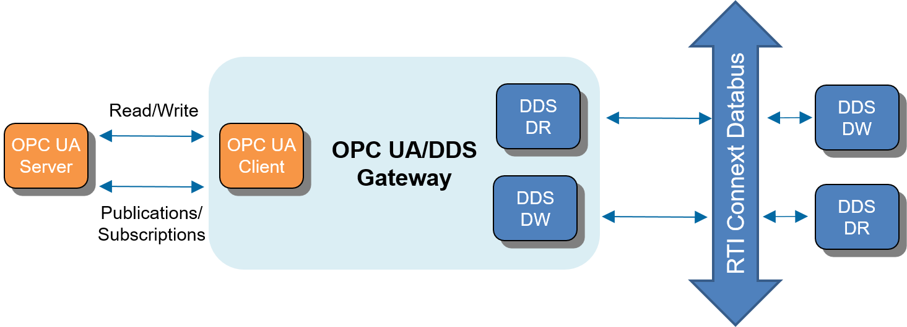

.. _section-introduction:

Introduction
============

OPC UA and DDS are two of the most prominent connectivity frameworks in the
Industrial Internet of Things.
Traditionally, application developers and system integrators have relied
on non-standard custom solutions to integrate DDS and OPC UA applications.
*RTI® OPC UA/DDS Gateway* leverages the `OMG OPC UA/DDS Gateway standard
<https://www.omg.org/spec/DDS-OPCUA>`_ to provide a simple generic
standards-based solution that provides a transparent bridge to integrate
unmodified OPC UA and DDS applications.

Simply configure the *OPC UA/DDS Gateway* to forward data in the Address
Space of OPC UA servers to the DDS Global Data Space or vice versa. The
*Gateway* will automatically instantiate all the required DDS entities and OPC
UA Clients to enable seamless communication with no changes required to
existing OPC UA and *RTI Connext® DDS* applications.

Prototype Overview
------------------

This document introduces a prototype implementation of the *RTI OPC UA/DDS
Gateway*. To help users understand the supported feature set, the documentation
only illustrates features that are available in the prototype.

This *OPC UA/DDS Gateway* prototype provides users with the ability
to configure OPC UA subscriptions to monitor the value of Variable Nodes in
the address space of an OPC UA Server, and to map such monitored items to
DDS *Topics* using a compatible type definition. Upon a successful
configuration, the *Gateway* will publish the configured *Topics* over to DDS
as data updates become available in the OPC UA Server. Moreover, the prototype
allows DDS applications to read and write individual Nodes in the address space
of an OPC UA Server through the *Gateway* using the *RTI Connext® DDS*
Request-Reply API. Lastly, the *Gateway* provides users with the ability to
subscribe to DDS *Topics*, and to map members of such *Topics* to Variable
Nodes in the address space of a remote OPC UA Server. As a result of such
configuration, the *Gateway* will update the Value of the configured Variable
Nodes in the remote OPC UA Server every time it receives a new sample of the
configured *Topic*.

    OPC UA/DDS Gateway Overview

The prototype implementation includes multiple built-in configurations that
illustrate how to use the *OPC UA/DDS Gateway* to interface with DDS
applications and a demo OPC UA Server. These examples and tutorials are
described in detail in :numref:`section-tutorials`.

Available Documentation
-----------------------

The *OPC UA/DDS Gateway* manual includes the following sections:

- :ref:`Installation <section-installation>`, which explains how to extract
  and install the *OPC UA/DDS Gateway* prototype.
- :ref:`Usage <section-usage>`, which explains how to run the
  *OPC UA/DDS Gateway* prototype.
- :ref:`Configuration <section-configuration>`, which explains how to configure
  the *OPC UA/DDS Gateway* prototype.
- :ref:`Tutorials <section-tutorials>`, includes a tutorial explaining how to
  run the default built-in configuration for the *OPC UA/DDS Gateway*
  prototype with DDS applications and a demo OPC UA Server.
- :ref:`Release Notes <section-release-notes>` documents the most recent
  additions and the limitations of the current prototype.

.. _section-path-mentioned-in-documentation:

Paths Mentioned in Documentation
--------------------------------

This documentation refers to:

- ``<DDSOPCUA_HOME>`` This refers to the installation directory for
  *Connext DDS*. The default installation paths are:

  - Mac® OS X® systems:
    ``/Applications/rti_dds_opcua_gateway-<version>``
  - UNIX®-based systems, non-root user:
    ``/home/your user name/rti_dds_opcua_gateway-<version>``
  - UNIX-based systems, root user:
    ``/opt/rti_dds_opcua_gateway-<version>``
  - Windows® systems, user without Administrator privileges:
    ``<your home directory>\rti_dds_opcua_gateway-<version>``
  - Windows systems, user with Administrator privileges:
    ``C:\Program Files\rti_dds_opcua_gateway-<version>``

  You may also see ``$DDSOPCUA_HOME`` or ``%DDSOPCUA_HOME%``, which refers to
  an environment variable set to the installation path.
  Whenever you see ``<DDSOPCUA_HOME>`` used in a path, replace it with your
  installation path.

  .. note::

    **Note for Windows Users:** When using a command prompt to enter a command
    that includes the path ``C:\Program Files`` (or any directory name that
    has a space), enclose the path in quotation marks. For example:
    ``"C:\Program Files\rti_dds_opcua_gateway-<version>\bin\rtiddsopcuagateway.bat"``.
    Or if you have defined the ``DDSOPCUA_HOME`` environment variable:
    ``"%DDSOPCUA_HOME%\bin\rtiddsopcuagateway.bat"``.

- ``<path to examples>`` By default, examples are copied into your home
  directory the first time you run *RTI Launcher* or any script in
  ``<DDSOPCUA_HOME>/bin``. This document refers to the location of the copied
  examples as ``<path to examples>``.

  Wherever you see ``<path to examples>``, replace it with the appropriate
  path. Default path to the examples:

  - Mac OS X systems:
    ``/Users/your user name/rti_workspace/<version>/examples``
  - UNIX-based systems:
    ``/home/your user name/rti_workspace/<version>/examples``
  - Windows systems:
    ``<your Windows documents folder>\rti_workspace\<version>\examples``.
    Where ``'<your Windows documents folder>'`` depends on your version of
    Windows. For example, on Windows 10 systems, the folder is
    ``C:\Users\<your user name>\Documents``.
