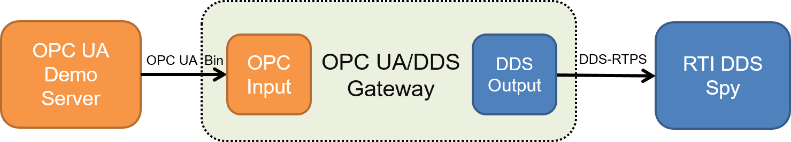
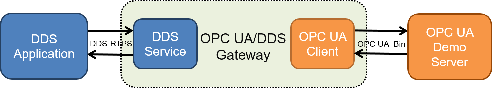
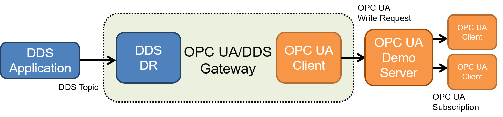
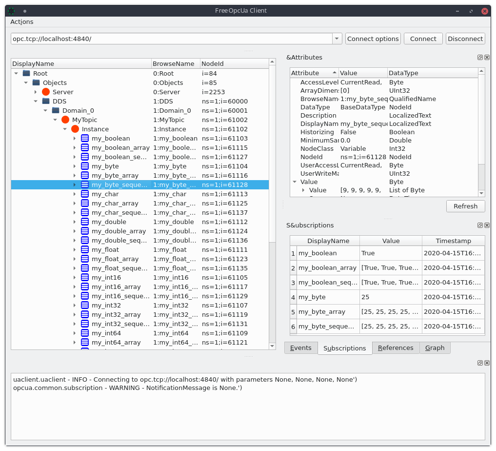
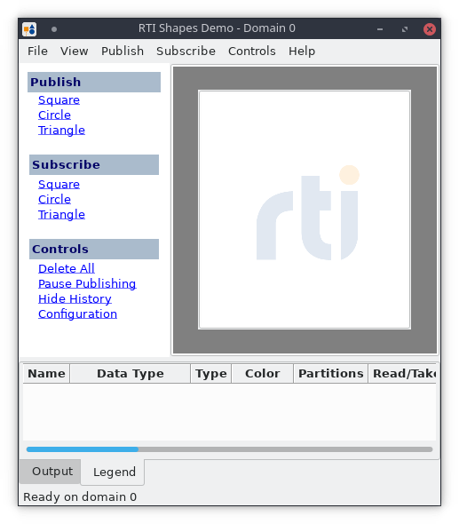
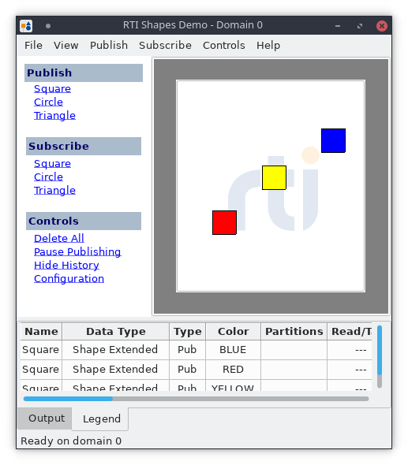
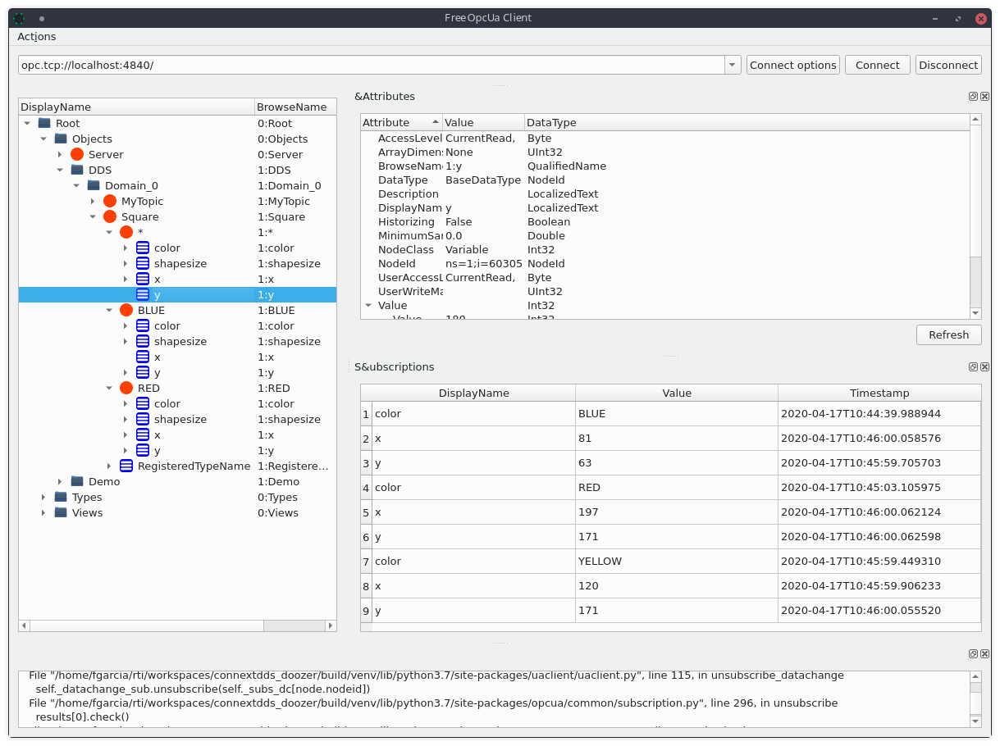

.. include:: vars.rst

.. _section-tutorials:

Tutorials
=========

.. _section-getting-started:

OPC UA to DDS: Getting Started
------------------------------

In this tutorial, you will run a demo OPC UA Server that provides a number of
Variable Nodes of different types. Then you will start an instance of the
*OPC UA/DDS Gateway* to bridge the value of the Nodes in the address space
of the OPC UA Server into the DDS Global Data Space. Lastly, you will use
*RTI DDS Spy* to subscribe to the DDS *Topic* the *OPC UA/DDS Gateway*
publishes as a result of data changes in the OPC UA Server.



    OPC UA to DDS Getting Started Demo Scenario Overview


Running Demo OPC UA Server
^^^^^^^^^^^^^^^^^^^^^^^^^^

As mentioned above, the *OPC UA/DDS Gateway* implementation provides a demo
OPC UA Server for testing purposes. In particular, the OPC UA Server contains
a number of Variable Nodes of basic OPC UA scalar and array types, which can be
accessed by OPC UA Clients, such as that included in the *OPC UA/DDS Gateway*.


The address space of the OPC UA Server is organized as follows:

.. code-block:: console

      Root
      ├── Objects
      │   ├── Demo
      │   │   ├── 001_Static
      │   │   │   ├── Arrays
      │   │   │   │   ├── Boolean
      │   │   │   │   ├── Byte
      │   │   │   │   ├── ByteString
      │   │   │   │   ├── ...
      │   │   │   │   └── XmlElement
      │   │   │   └── Scalar
      │   │   │       ├── Boolean
      │   │   │       ├── Byte
      │   │   │       ├── ByteString
      │   │   │       ├── ...
      │   │   │       └── XmlElement
      │   │   └── 002_Dynamic
      │   │       ├── Arrays
      │   │       │   ├── Boolean
      │   │       │   ├── Byte
      │   │       │   ├── ByteString
      │   │       │   ├── ...
      │   │       │   └── XmlElement
      │   │       └── Scalar
      │   │           ├── Boolean
      │   │           ├── Byte
      │   │           ├── ByteString
      │   │           ├── ...
      │   │           └── XmlElement
      │   └── Server
      ├── Types
      └── Views

Where ``001_Static`` contains Variable Nodes with a static value and
``002_Dynamic`` contains Variable Nodes whose value varies every second.
Every Variable Node located in Namespace 1 and is identified by a numeric
identifier within the following ranges:

* Static Scalars -- [51001,51021]
* Static Arrays -- [51101,51121]
* Dynamic Scalars -- [52001,52021]
* Dynamic Arrays -- [52101,52121].


To run the OPC UA Demo Server, run the corresponding script under
``<DDSOPCUA_HOME>/bin`` as follows:

.. code-block:: console

    $ ./tutorial-opc-ua-server
      [0000-00-00 00:00:00.00 (UTC+0000)] info/network TCP network layer listening on opc.tcp://localhost:4840/

If successful, the command will start an OPC UA Server on the default TCP port:
4840. The default configuration will trigger an update on the value of the
Variable Nodes in the address space of the server every 1000 milliseconds.

If you want to change the update rate, you can indicate the desired update
rate using the ``-updatePeriod <NUMBER>`` argument. Likewise, you can modify
the default TCP port using the ``-port <NUMBER>`` argument.

Below we show the complete list of arguments for ``tutorial-opc-ua-server``:

.. code-block:: console

    $ ./tutorial-opc-ua-server -help
    Demo OPC UA Server to test RTI OPC UA/DDS Gateway
    Usage: tutorial-opc-ua-server [OPTIONS]*
    -help                          display this help and exit.
    -port <NUMBER>                 change the port number for OPC UA server.
    -updatePeriod <NUMBER (ms)>    indicates how often must the server update the nodes' value.

Running OPC UA/DDS Gateway
^^^^^^^^^^^^^^^^^^^^^^^^^^

Once you are running the OPC UA Demo Server on a terminal, you can start the
*OPC UA/DDS Gateway* to start bridging data to the DDS Global Data Space.

To run the *OPC UA/DDS Gateway*, run the corresponding script under
``<DDSOPCUA_HOME>/bin`` as follows:

.. code-block:: console

    $ ./rtiddsopcuagateway -cfgName default
    RTI OPC UA/DDS Gateway <version>

If successful, the Gateway will start publishing a DDS Topic on Domain 0
containing the updated value of the Variable Nodes in the Server running on
port 4840.

By default the *OPC UA/DDS Gateway* loads an XML configuration file under
``<DDSOPCUA_HOME>/resources/xml/RTI_DDS_OPCUA_SERVICE.xml``. The configuration in
this file is always available, regardless of the installation path or working
directory.

``RTI_DDS_OPCUA_SERVICE.xml`` is especially configured to connect and work out
of the box with the OPC UA Demo Server. Below we analyize the different
sections to illustrate how it matches the default behavior.

Configuring DDS Types
`````````````````````
First, within the ``<types>`` tag, we define a new type named ``ScalarTypes``
that can hold the value of every Variable Node with a scalar value in the
address space of the OPC UA Server.

.. literalinclude:: ../resources/xml/RTI_DDS_OPCUA_SERVICE.xml
    :language: XML
    :lines: 21-61
    :linenos:
    :dedent: 4
    :lineno-start: 20

As you may have noticed, the *OPC UA/DDS Gateway* references some
non-primitive DDS types that are equivalent to builtin OPC UA types (e.g.,
`NodeId`). These types are available on the ``rti::opcua::types`` built-in
module, and can be referenced from the configuration file as shown in the
example.

Configuring OPC UA/DDS Gateway Service
``````````````````````````````````````
As explained in :numref:`section-config-ddsopcua-service-tag`, an *OPC UA/DDS
Gateway* configuration file may contain multiple configurations, each of
them defined under a ``<ddsopcua_service>`` tag. In this example, the
configuration file includes a single configuration named ``default``, which you
might recall is the value of the ``-cfgName`` argument we passed via
command-line when we started the *OPC UA/DDS Gateway*.


Configuring OPC UA Connections
``````````````````````````````
The default configuration subscribes to a set of monitored items from an OPC
UA server and publishes the information to a DDS Topic.

On one hand, the OPC UA Server is specified via the ``opcua_connection`` tag:

.. literalinclude:: ../resources/xml/RTI_DDS_OPCUA_SERVICE.xml
    :language: XML
    :lines: 264-267
    :linenos:
    :dedent: 8
    :lineno-start: 264

As shown above, the ``server_endpoint_url`` configures the Gateway to connect
to an OPC UA Server that listens on ``localhost`` on port ``4840``.

Configuring DDS DomainParticipants
``````````````````````````````````
The DomainParticipant that joins DDS Domain 0 is configured as follows:

.. literalinclude:: ../resources/xml/RTI_DDS_OPCUA_SERVICE.xml
    :language: XML
    :lines: 271-275
    :linenos:
    :dedent: 8
    :lineno-start: 271

Note that the DomainParticipant registers the ``ScalarTypes`` type declared
above, so that it can be used later on in the context of DDS Output.

Configuring OPC UA to DDS Bridges and Subscriptions
```````````````````````````````````````````````````
The next step is to create an ``<opcua_to_dds_bridge>``. The bridge makes
it possible to read data from an OPC UA server and send it to DDS. In this
case, ``<opcua_to_dds_bridge name="MyOpcUa2DdsBridge">`` declares a
``<subscription>`` that configures the Gateway to map an OPC UA Input to
an OPC UA Output.

.. note::

    Future versions of this product may include support for DDS to OPC UA
    Bridges, which configure OPC Servers embedded into the Gateway to provide
    OPC UA Clients with a representation of the DDS Global Data Space in the
    address space of the embedded server.

Configuring OPC UA Inputs and DDS Outputs
`````````````````````````````````````````

Lastly, we must configure OPC UA Inputs and DDS Outputs.

OPC UA Inputs must be associated with an already declared OPC UA
Connections. In our example, we create ``MyInput`` and associate it with
``MyServerConnection`` using the ``opcua_connection_ref`` attribute.
``MyInput`` contains the list of items to monitor and configures aspects
of the subscription protocol, such as the ``<requested_publishing_interval>``.

.. literalinclude:: ../resources/xml/RTI_DDS_OPCUA_SERVICE.xml
    :language: XML
    :lines: 299-465
    :linenos:
    :dedent: 16
    :lineno-start: 299

When adding node attributes to monitor, you must set the
``dds_topic_field_name`` attribute to match the name of a member of the
Data Type associated with the DDS Output Topic. That will indicate the field
within the DDS Topic that will contain the value of the node attribute.

For example, when we declare
``<node_attribute dds_topic_field_name="my_boolean">``, we use the
``my_boolean`` name, because we want to assign the value of the data
item to the ``my_boolean`` member of the ``ScalarTypes`` DDS type associated
with the ``ScalarTypesTopic`` in the DDS Output.

DDS Output must in turn be associated with an already declared DDS
*DomainParticipant*. In our example, we create ``MyOutput`` and associate it
with ``MyDomainParticipant`` using the ``domain_participant_ref`` attribute.
``MyOutput`` configures the name of the Topic to publish using the
``<topic_name>`` tag. The type associated with the Topic is ``ScalarTypes``,
which was before registered with ``MyDomainParticipant``. Lastly, ``MyOutput``
configures the internal DDS *DataWriter* to provide a durable publication
with ``TRANSIENT_LOCAL_DURABILITY``.

.. literalinclude:: ../resources/xml/RTI_DDS_OPCUA_SERVICE.xml
    :language: XML
    :lines: 469-483
    :linenos:
    :dedent: 16
    :lineno-start: 469

.. _section_running_rtiddsspy:

Running RTI DDS Spy
^^^^^^^^^^^^^^^^^^^

Once you are running both the OPC UA Demo Server and the *OPC UA/DDS Gateway*
you can subscribe to the data published by the Gateway on Domain 0, as a result
of the data changes in the OPC UA Server.

To run the *RTI DDS Spy* utility, run the corresponding script under
``<CONNEXTDDS_DIR>/bin`` as follows:

.. code-block:: console

    $ ./rtiddsspy -printSample

    RTI Connext DDS Spy
    Copyright 2012 Real-Time Innovations, Inc.
    ~~~~~~~~~~~~~~~~~~~~~~~~~~~~~~~~~~~~~~~~~~
    rtiddsspy is listening for data, press CTRL+C to stop it.

    source_timestamp   Info  Src HostId  topic               type
    -----------------  ----  ----------  ------------------  ------------------
    1561684484.230629  W +N  C0A8013D    ScalarTypesTopic    ScalarTypes
    1561684684.364656  d +N  C0A8013D    ScalarTypesTopic    ScalarTypes
    my_boolean: false
    my_sbyte: 32
    my_byte: 144
    my_int16: 4225
    my_uint16: 4226
    my_int32: 4227
    my_uint32: 4228
    my_int64: 4229
    my_uint64: 4230
    my_float: 2115.5
    my_double: 2116
    my_string: "Odd"
    my_datetime: -4234
    my_guid:
    data1: 4235
    data2: 4235
    data3: 4235
    data4:
        [0]: 44
        [1]: 44
        [2]: 44
        [3]: 44
        [4]: 44
        [5]: 44
        [6]: 44
        [7]: 44
    my_bytestring:
    [0]: 69
    [1]: 118
    [2]: 101
    [3]: 110
    my_xmlelement: "<Odd></Odd>"
    my_nodeid:
    namespace_index: 42
    identifier_type:
        _d: STRING_NODE_ID
            string_id: "Odd"
    my_expandednodeid:
    namespace_index: 0
    identifier_type:
        _d: OPAQUE_NODE_ID
            opaque_id:
                [0]: 69
                [1]: 118
                [2]: 101
                [3]: 110
    namespace_uri: "http://www.rti.com"
    server_index: 0
    my_statuscode: 4240
    my_qualifiedname:
    namespace_index: 42
    name: "Odd"
    my_localizedtext:
    locale: "en-US"
    text: "Even"

If successful, you should start receving DDS data sample updates every time a
new data change occurs in the OPC UA Demo Server via the Gateway. The updates
you receive are published by the *OPC UA/DDS Gateway* on Domain 0 using the
``ScalarTypesTopic``.

Summary
^^^^^^^

In this tutorial you have learned how to run the *OPC UA/DDS Gateway*
to bridge data from an OPC UA Server into the DDS Global Data Space.

To illustrate the process, first we have run an OPC UA Demo Server:

.. code-block:: console

   $ $DDSOPCUA_HOME/bin/tutorial-opc-ua-server

Then, we have started the *OPC UA/DDS Gateway* to start bridging data into the
DDS Global Data Space:

.. code-block:: console

   $ $DDSOPCUA_HOME/bin/rtiddsopcuagateway -cfgName default

Lastly, we have started *RTI DDS Spy* to subscribe to the DDS data published
by the *OPC UA/DDS Gateway* as a result of data changes in the OPC UA Server.

.. code-block:: console

   $ $CONNEXTDDS_DIR/bin/rtiddsspy -printSample

.. _section-opcua2dds-read-write:

OPC UA to DDS: Reading and Writing OPC UA Data from DDS
-------------------------------------------------------

The *OPC UA/DDS Gateway* embeds a DDS Service that exposes a subset of the
OPC UA Service Sets that native OPC UA Clients use to communicate with Servers.
In particular, this version of the *Gateway* exposes the Attribute Service Set,
which provides DDS applications with read and write remote procedures to
operate on Variable Nodes in the address space of an OPC UA Server.

In this tutorial, we show how to perform read and write operations using a
generic DDS command-line application, and the same OPC UA Server and *Gateway*
configuration we exercised in :numref:`section-getting-started`.



    DDS Service to Expose an OPC UA Server

.. _section-start-server-and-gateway:

Running OPC UA Demo Server and OPC UA/DDS Gateway
^^^^^^^^^^^^^^^^^^^^^^^^^^^^^^^^^^^^^^^^^^^^^^^^^

As we mentioned above, in this example we  use the same OPC UA Demo Server and
*Gateway* configuration we used in the previous tutorial.

Running OPC UA Demo Server
``````````````````````````

To run the OPC UA Demo Server, run the corresponding script under
``<DDSOPCUA_HOME>/bin`` as follows:

.. code-block:: console

    $ ./tutorial-opc-ua-server
      [0000-00-00 00:00:00.00 (UTC+0000)] info/network TCP network layer listening on opc.tcp://localhost:4840/

Running OPC UA/DDS Gateway
``````````````````````````

To run the *OPC UA/DDS Gateway*, run the corresponding script under
``<DDSOPCUA_HOME>/bin`` as follows:

.. code-block:: console

    $ ./rtiddsopcuagateway -cfgName default
    RTI OPC UA/DDS Gateway <version>


As you can see, the *OPC UA to DDS Bridge* ``MyOpcUa2DdsBridge`` included in
the ``default`` configuration (part of ``RTI_DDS_OPCUA_SERVICE.xml``) exposes
the attribute service set of the OPC UA Server behind ``MyServerConnection``
using the ``<service_set>`` tag as follows:

.. literalinclude:: ../resources/xml/RTI_DDS_OPCUA_SERVICE.xml
    :language: XML
    :lines: 277-297
    :linenos:
    :emphasize-lines: 8-17
    :dedent: 4
    :lineno-start: 277

On the DDS side, the *Gateway* configuration uses ``MyDomainParticipant``
to instantiate a DDS *DataReader* for processing service requests, and a DDS
*DataWriter* to issue service replies. Thus, any DDS application capable of
publishing the *Request Topic* and subscribing to the *Reply Topic* will be
able to read and write data from the remote OPC UA Server through the Gateway.

Running Demo OPC UA/DDS Gateway Requester Application
^^^^^^^^^^^^^^^^^^^^^^^^^^^^^^^^^^^^^^^^^^^^^^^^^^^^^

To abstract developers and system integrators from the intricacies of
request-reply interactions, such the encapsulation of data that flows from
and into the OPC UA Server and the correlation of requests and replies,
future versions of the *OPC UA/DDS Gateway* will provide a generic Requester
API for DDS applications. In this version of the *Gateway* we provide a
command-line application called ``tutorial-dds-requester`` that leverages
an initial version of the API and simplifies the out of the box experience for
demonstration purposes.

``tutorial-dds-requester`` supports two commands: ``read`` and ``write``.

.. code-block:: console

    usage:  tutorial-dds-requester [--help]
                                   <command> [<args>]

    These are the supported commands:

    read   Reads the value of a Variable Node in the addressspace of an OPC UA Server.

        tutorial-dds-requester read --server-id <server_id>
                                    --node-id <namespace_index>:<identifier>
                                    [--iterations <number_of_iterations>]
                                    [--period <milliseconds_between_reads>]
                                    [--domain-id <dds_domain_id>]

    write  Updates the value of a Variable Node in the addressspace of an OPC UA Server.

        tutorial-dds-requester write --server-id <server_id>
                                     --node-id <namespace_index>:<identifier>
                                     --type "<value_type>"
                                     --value "<value>"
                                     [--iterations <number_of_iterations>]
                                     [--period <milliseconds_between_writes>]
                                     [--domain-id <dds_domain_id>]

Each command takes its own command-line arguments that indicate the remote
OPC UA Server that must address the requests. The OPC UA Server must be
exposed by an appropriate ``<service_set opcua_connection_ref="...">`` in
a discoverable *OPC UA/DDS Gateway*.

Reading Data from the OPC UA Server
```````````````````````````````````

Use the ``read`` command to read data from the OPC UA Server. The
current implementation supports reading both scalar and array Variable Nodes,
as long as the requested OPC UA Server is available and the Node to be read
exists. Upon the reception of the most recent value of the requested Variable
Node, the tool will print out a JSON string with the corresponding response.

For example, once you have started the Demo OPC UA Server and the
*OPC UA/DDS Gateway* as described in
:numref:`section-start-server-and-gateway`, you can read the current value of
the Scalar Boolean Variable Node within the ``002_Dynamic`` folder using the
`tutorial-dds-requester` under `<DDSOPCUA_HOME>/bin` as follows:

.. code-block:: console

    $ ./tutorial-dds-requester read --server-id "MyServerConnection" --node-id 1:52001
    {
      "status_code":0,
      "reason_phrase":"Good",
      "reply":{
          "read_reply":{
            "value":{
                "array_dimensions":[],
                "value":{
                  "bool_value":[true]
                }
            }
          }
      }
    }

To repeat the operation multiple times, you can use the ``--iterations`` and
``--period`` arguments. For example, to read the current value of the Array
Boolean Variable Node within the ``002_Dynamic`` every 1000 milliseconds
(i.e., every 1 second) a total of 5 times, execute:

.. code-block:: console

    $ ./tutorial-dds-requester read --server-id "MyServerConnection" --node-id 1:52101 --iterations 3 --period 1000
    {
      "status_code":0,
      "reason_phrase":"Good",
      "reply":{
          "read_reply":{
            "value":{
                "array_dimensions":[0],
                "value":{
                  "bool_value":[true,true,true,true,true,true,true,true,true,true]
                }
            }
          }
      }
    }

    {
      "status_code":0,
      "reason_phrase":"Good",
      "reply":{
          "read_reply":{
            "value":{
                "array_dimensions":[0],
                "value":{
                  "bool_value":[false,false,false,false,false,false,false,false,false,false]
                }
            }
          }
      }
    }

    {
      "status_code":0,
      "reason_phrase":"Good",
      "reply":{
          "read_reply":{
            "value":{
                "array_dimensions":[0],
                "value":{
                  "bool_value":[true,true,true,true,true,true,true,true,true,true]
                }
            }
          }
      }
    }

Writing Data on the OPC UA Server
`````````````````````````````````

Use the ``write`` command to write data on the OPC UA Server. The
current implementation can only write scalar values of boolean, integer, and
string types. For the write operation to succeed, the requested OPC UA Server
must be available, the Node to be written must exist, and a valid value
string representation, and the type name must be provided as well. Upon the
reception of a response the tool will print out its JSON representation.

For example, once you have started the Demo OPC UA Server and the
*OPC UA/DDS Gateway* as described in
:numref:`section-start-server-and-gateway`, you can update the current value of
the Scalar Boolean Variable Node within the ``001_Static`` folder as follows:

.. code-block:: console

    $ ./tutorial-dds-requester write --server-id "MyServerConnection" --node-id 1:51001 --value true --type boolean
    {
      "status_code":0,
      "reason_phrase":"Good",
      "reply":{
          "write_reply":0
      }
    }

Or the current value of the Scalar String Variable Node in the same folder as
follows:

.. code-block:: console

    $ ./tutorial-dds-requester write --server-id "MyServerConnection" --node-id 1:51012 --value "New String" --type string
    {
      "status_code":0,
      "reason_phrase":"Good",
      "reply":{
          "write_reply":0
      }
    }

.. _section-dds2opcua-getting-started:

DDS to OPC UA: Getting Started
------------------------------

In this tutorial, you will run a simple DDS application that publishes a DDS
*Topic* containing scalar, sequence, and array fields. On the other side,
you will run our demo OPC UA Server that instantiates Variable Nodes, which we
will populate with DDS information using the *OPC UA/DDS Gateway*.
As you will see, the *Gateway* provides syntax to map the different fields of
the DDS *Topic* to the Value Attribute of those Variable Nodes in the OPC UA
Server.



    DDS to OPC UA Getting Started Scenario Overview

Running DDS Demo Application
^^^^^^^^^^^^^^^^^^^^^^^^^^^^

To start publishing DDS data, open a new terminal and run
``tutorial-dds-publisher`` as follows:

.. code-block:: console

    $ ./tutorial-dds-publisher

The ``tutorial-dds-publisher`` utility publishes a new sample of ``MyTopic`` every
second. You can use ``rtiddsspy`` if you want to see the information the
application publishes, as we explained in :numref:`section_running_rtiddsspy`.

.. _section-dds2opcua-server:

Running OPC UA Demo Server
^^^^^^^^^^^^^^^^^^^^^^^^^^

The OPC UA Server we have used in previous tutorials includes a folder named
``DDS`` with a subfolder named ``Domain_0`` that contains some of the *Topics*
that could be exchanged in a DDS *Domain*: ``MyTopic`` and ``Square``.
Each *Topic* has one or more instances with their corresponding fields.

.. code-block:: console

      Root
      ├── Objects
      │   ├── DDS
      │   │   └── Domain_0
      │   │       ├── MyTopic
      │   │       │   └── Instance
      │   │       │       ├── my_boolean
      │   │       │       ├── my_boolean_array
      │   │       │       ├── my_boolean_sequence
      │   │       │       ├── ...
      │   │       │       ├── my_string
      │   │       │       ├── my_string_array
      │   │       │       └── my_string_sequence
      │   │       └── Square
      │   │           ├── BLUE
      │   │           │   ├── color
      │   │           │   ├── x
      │   │           │   ├── y
      │   │           │   └── shapesize
      │   │           ├── RED
      │   │           │   ├── color
      │   │           │   ├── x
      │   │           │   ├── y
      │   │           │   └── shapesize
      │   │           └── *
      │   │               ├── color
      │   │               ├── x
      │   │               ├── y
      │   │               └── shapesize
      │   ├── Demo
      │   │   └── ...
      │   └── Server
      ├── Types
      └── Views

.. note::

    The organization we use in this example follows the OPC UA Information
    Model to represent the DDS Global Data Space defined in the `OMG OPC UA/DDS
    Gateway standard <https://www.omg.org/spec/DDS-OPCUA>`_. However, the
    mapping rules we illustrate in this example can be applied to any OPC UA
    Information Model.

To start the OPC UA Demo Server, run the corresponding script under
``<DDSOPCUA_HOME>/bin`` from a new terminal as follows:

.. code-block:: console

    $ ./tutorial-opc-ua-server
      [0000-00-00 00:00:00.00 (UTC+0000)] info/network TCP network layer listening on opc.tcp://localhost:4840/


Running OPC UA/DDS Gateway
^^^^^^^^^^^^^^^^^^^^^^^^^^

Once we have both the DDS and OPC UA applications running, we can start
bridging data using the *OPC UA/DDS Gateway*. In particular, to bridge the
information ``MyTopic`` provides into the OPC UA Demo Server, run the
*OPC UA/DDS Gateway* using the script under ``<DDSOPCUA_HOME>/bin`` in a new
terminal as follows:

.. code-block:: console

    $ ./rtiddsopcuagateway -cfgName publicationExample
    RTI OPC UA/DDS Gateway <version>

If successful, the Gateway will subscribe to ``MyTopic`` on Domain 0 and will
update the value of all the Variable Nodes in the address space of the
OPC UA Server under ``DDS/Domain_0/MyTopic/Instance``.

In the sections below we illustrate how we have configured the *Gateway* for
such purpose, like in the rest of examples this configuration may be found
under ``<DDSOPCUA_HOME>/resources/xml/RTI_DDS_OPCUA_SERVICE.xml``.

.. _section-configuring-dds-types-mytype:

Configuring DDS Types
`````````````````````
First, we need to configure the types. Within the ``<types>`` tag, we define
a new type named ``MyType`` that contains scalar, array, and sequence fields
of all the DDS types the current implementation of the *OPC UA/DDS Gateway*
supports: ``boolean``, ``byte``, ``int16``, ``uint16``, ``int32``, ``uint32``,
``int64``, ``uint64``, ``float``, ``double``, ``char``, and ``string``.

.. literalinclude:: ../resources/xml/RTI_DDS_OPCUA_SERVICE.xml
    :language: XML
    :lines: 147-237
    :linenos:
    :dedent: 4
    :lineno-start: 147

Configuring OPC UA/DDS Gateway Service
``````````````````````````````````````
Then, we configure new OPC UA/DDS Gateway Service. As explained in
:numref:`section-config-ddsopcua-service-tag`, an *OPC UA/DDS Gateway*
configuration file may contain multiple configurations, each of
them defined under a ``<ddsopcua_service>`` tag.

In this tutorial, we create a new service tag named ``publicationExample``.

.. literalinclude:: ../resources/xml/RTI_DDS_OPCUA_SERVICE.xml
    :language: XML
    :lines: 852
    :linenos:
    :dedent: 4
    :lineno-start: 852


Configuring DDS DomainParticipants
``````````````````````````````````
To subscribe to DDS data, we have to first define a *DomainParticipant* that is
capable of joining the desired DDS Domain, in this case Domain 0:

.. literalinclude:: ../resources/xml/RTI_DDS_OPCUA_SERVICE.xml
    :language: XML
    :lines: 863-866
    :linenos:
    :dedent: 8
    :lineno-start: 863

The DomainParticipant registers both the aforementioned ``MyType`` and
``ShapeType``, which we will use in the next tutorial.


Configuring OPC UA Connections
``````````````````````````````

To communicate with the remote OPC UA Server, we need to create an OPC UA
connection with the appropriate configuration:

.. literalinclude:: ../resources/xml/RTI_DDS_OPCUA_SERVICE.xml
    :language: XML
    :lines: 860-861
    :linenos:
    :dedent: 8
    :lineno-start: 860

Configuring OPC UA to DDS Bridge and Publications
`````````````````````````````````````````````````
Next, we need to create an ``<opcua_to_dds_bridge>`` capable of subscribing to
DDS data and to forward that data (publish it) to the OPC UA Server. From
the OPC UA to DDS bridge's standpoint we refer to this concept a logical
"publication", because we write (publish) data into an OPC UA Server (as
opposed to the concept of logical "subscriptions", where we
read—or subscribe to—data from an OPC UA Server).

In this case, ``<opcua_to_dds_bridge name="MyDds2OpcUaBridge">`` declares a
``<publication>`` named ``ExamplePublication`` that, as we explain below,
declares a DDS Input and an OPC UA Output.

.. literalinclude:: ../resources/xml/RTI_DDS_OPCUA_SERVICE.xml
    :language: XML
    :lines: 868-877
    :linenos:
    :dedent: 8
    :lineno-start: 868


Configuring DDS Inputs and OPC UA Outputs
`````````````````````````````````````````
A DDS Input must be associated with a *DomainParticipant* and a *Topic*. In
this example, we use the aforementioned ``MyDomainParticipant`` via the
``domain_participant_ref`` attribute of the ``<dds_input>`` definition, as well
as the ``<topic_name>`` and ``<registered_type_name>`` (which we previously
registered with the *DomainParticipant*) as follows:

.. literalinclude:: ../resources/xml/RTI_DDS_OPCUA_SERVICE.xml
    :language: XML
    :lines: 878-882
    :linenos:
    :dedent: 12
    :lineno-start: 878

DDS Inputs may configure other aspects, such as the QoS policies of the
internal DDS *DataReaders* and sample selectors. We will show how to use
these advanced settings in the next tutorial.

On the other hand, an OPC UA Output must be associated with an OPC UA
Connection providing access to the remote Server: ``MyServerConnection``.
The OPC UA Output must define also all the Node Attributes to be updated upon
the reception of a new sample of the *Topic* associated with the DDS Input.
The Node Attribute declaration must include its corresponding Node and
Attribute IDs. Also, it must provide the ``dds_topic_field_name`` that the
*Gateway* will read to update the Node Attribute.

.. literalinclude:: ../resources/xml/RTI_DDS_OPCUA_SERVICE.xml
    :language: XML
    :lines: 883-1137
    :linenos:
    :dedent: 12
    :lineno-start: 883

.. _section-subscribing-with-generic-opcua-client:

Bonus: Subscribing to OPC UA Server with a Generic OPC UA Client
^^^^^^^^^^^^^^^^^^^^^^^^^^^^^^^^^^^^^^^^^^^^^^^^^^^^^^^^^^^^^^^^

Often, OPC UA SDKs provide generic client applications that are capable of
browsing and visualizing informaton in any OPC UA Server. In this section,
we explain how use the `FreeOpcUa Simple OPC UA GUI Client
<https://github.com/FreeOpcUa/opcua-client-gui>`_ to subscribe to data changes
in the aforementioned Nodes of the OPC UA Demo Server, to check that the
*OPC UA/DDS Gateway* is indeed updating their value with the reception of
every new samples of ``MyTopic``.

To install the FreeOpcUa OPC UA GUI Client, you will need to install Python 3
and Python pip on your machine. With that, simply instal the client as follows:

.. code:: console

    $ pip install pyqt5 opcua-client

.. note::

    For further instructions on how to install the Client, please refer to the
    `FreeOpcUa Simple OPC UA GUI Client GitHub repository
    <https://github.com/FreeOpcUa/opcua-client-gui>`_.

Once you have installed the client, you start it as follows:

.. code:: console

    $ opcua-client


As we show in :numref:`FreeOpcUaSubscription`, you can access the address space
of the OPC UA Demo Server at ``opc.tcp://localhost:4840/``. Upon a sucessful
connection, you will find the Variable Nodes the *OPC UA/DDS Gateway* updates
under ``Root/Objects/DDS/Domain_0/MyTopic/Instance``.



    FreeOpcUa Simple GUI Client Subscribing to OPC UA Demo Server

To subscribe to data changes, right click on any Variable Node and click on
"Subscribe to data change". The tool will then display the current value for
all monitored items under the Subscriptions panel as we show in
:numref:`FreeOpcUaSubscription`.

Summary
^^^^^^^

In this tutorial you have learned how to run the *OPC UA/DDS Gateway*
to bridge data from DDS into an OPC UA Server.

To illustrate the process, first we have started a DDS demo application:

.. code-block:: console

    $ $DDSOPCUA_HOME/bin/tutorial-dds-publisher


Then, we have started an OPC UA Demo Server:

.. code-block:: console

   $ $DDSOPCUA_HOME/bin/tutorial-opc-ua-server


And lastly, we have run the *OPC UA/DDS Gateway* to bridge DDS data into the
OPC UA Server:

.. code-block:: console

   $ $DDSOPCUA_HOME/bin/rtiddsopcuagateway -cfgName publicationExample

As a bonus, we have discussed how to use a generic OPC UA Client application to
visualize the Nodes in the address space of the OPC UA Demo Server that the
*OPC UA/DDS Gateway* updates.

DDS to OPC UA: Using Sample Selector
------------------------------------

In DDS, it is usual to represent a common piece of information from different
sensors and devices using a single *Topic*. These *Topics* ofen include one or
more key fields to identify the device or sensor. For keyed *Topics*, the value
of key fields denotes different instances of the *Topic*. As a result, a
single *DataReader* can subscribe to updates from multiple sensors and devices.
To process information from each device separetely, the *DataReader* can read
by instance, setup content-filters, or use query conditions. By contrast, most
OPC UA information models organize information from different sensors and
devices using a hierarchy of Nodes, where each sensor or device has a common
ancestor and similar set of depedent Nodes.

To provide a simple mechanism to assign fields of a DDS *Topic* to individual
Node Attributes, based on a *Topic* instance or specific filter condition,
the *OPC UA/DDS Gateway* allows the configuration of sample selectors. In this
tutorial, we explain how to configure a publication that subscribes to a *Topic*
published by *RTI Shapes Demo*—the ``Square`` *Topic*—and writes the position
and size of squares in different Variable Nodes of the OPC UA Server's address
space depending on the color of the ``Square``, making use of sample selectors.

Running RTI Shapes Demo
^^^^^^^^^^^^^^^^^^^^^^^

As we mentioned above, in this tutorial we use *RTI Shapes Demo* to publish
the position of squares of different colors over DDS. *RTI Shapes Demo* is part
of a regular *RTI Connext DDS* installation, but it is also available for
download as a separate component
`here <https://www.rti.com/free-trial/shapes-demo>`_.

Once you have installed *RTI Shapes Demo*, start the application as follows
from ``<RTISHAPESDEMO_HOME>/bin``:

.. code:: console

    $ ./rtishapesdemo

You should see the *RTI Shapes Demo* window as shown in
:numref:`ShapesDemoApplication`.



    RTI Shapes Demo application

In this tutorial you will need to create a RED, BLUE, and YELLOW square. To
create each Square, click on Publish -> Square, and select the corresponding
color. Once you have created the three squares, you will see each square moving
around the canvas as we show in :numref:`ShapesDemoApplication2`:



    RTI Shapes Demo application publishing three squares


Running OPC UA Demo Server
^^^^^^^^^^^^^^^^^^^^^^^^^^

On the other side, you will need to run the OPC UA Demo Server. As we explained
in :numref:`section-dds2opcua-server`, the Server instantiates a number of
Nodes to represent DDS *Topics*, including the ``Square`` *Topic* that
*RTI Shapes Demo* publishes.
Under ``DDS/Domain_0/Square`` you will find three different Nodes: ``RED``,
``BLUE``, and ``*`` that represent red squares, blue squares, and squares of
any color, respectively.

To start the OPC UA Demo Server, run the corresponding script under
``<DDSOPCUA_HOME>/bin`` from a new terminal as follows:

.. code-block:: console

    $ ./tutorial-opc-ua-server
      [0000-00-00 00:00:00.00 (UTC+0000)] info/network TCP network layer listening on opc.tcp://localhost:4840/

Running OPC UA/DDS Gateway
^^^^^^^^^^^^^^^^^^^^^^^^^^

Once you have both *RTI Shapes Demo* and the OPC UA Demo Server running, you
can start bridging data using the *OPC UA/DDS Gateway*. In this example, we
will use the same configuration we used in the previous tutorial; using the
script ``<DDSOPCUA_HOME>/bin`` in a new terminal as follows:

.. code-block:: console

    $ ./rtiddsopcuagateway -cfgName publicationExample
    RTI OPC UA/DDS Gateway <version>

If successful, the Gateway will subscribe to ``Square`` on Domain 0 and will
update the value of all the Variable Nodes in the address space of the
OPC UA Server under ``DDS/Domain_0/Square/RED``,  ``DDS/Domain_0/Square/BLUE``,
and ``DDS/Domain_0/Square/*``.

Configuring DDS Types
`````````````````````
First, we need to configure the types. Within the ``<types>`` tag, we define
a new type named ``ShapeType`` that describes the ``Square`` *Topic* (and any
other shape in general, such as ``Circle`` and ``Triangle``).

.. literalinclude:: ../resources/xml/RTI_DDS_OPCUA_SERVICE.xml
    :language: XML
    :lines: 122-131
    :linenos:
    :dedent: 4
    :lineno-start: 122

Configuring OPC UA/DDS Gateway Service
``````````````````````````````````````
Then, we configure new OPC UA/DDS Gateway Service. In this tutorial, we
use the ``publicationExample`` service tag, which we described in the previous
example.

Likewise, we use the same DDS *DomainParticipant* and OPC UA connection we used
in the previous example.

Configuring OPC UA to DDS Bridge and Publications
`````````````````````````````````````````````````
As we explained in the previous tutorial, the ``<opcua_to_dds_bridge>`` can
create different publications. Besides ``ExamplePublication``,
``MyDds2OpcUaBridge`` declares a ``<publication>`` named ``SquarePublication``
for this example, with its corresponding DDS Input and OPC UA Output.

.. literalinclude:: ../resources/xml/RTI_DDS_OPCUA_SERVICE.xml
    :language: XML
    :lines: 1108
    :linenos:
    :dedent: 8
    :lineno-start: 1108

Configuring DDS Inputs and OPC UA Outputs
`````````````````````````````````````````
Our DDS Input configures the *Gateway* to subscribe to the ``Square`` *Topic*.
On top of that, it declares three different selectors that OPC UA Outputs can
use to assign only a subset of the received samples to the corresponding Node
Attributes. In this case, we define two sample selectors, which filter by color
(``RED`` and ``BLUE``).

.. literalinclude:: ../resources/xml/RTI_DDS_OPCUA_SERVICE.xml
    :language: XML
    :lines: 1109-1121
    :linenos:
    :dedent: 12
    :lineno-start: 1109

On the other side, the OPC UA Output adds mapping options for the Value
Attribute of all Variable Nodes under ``RED``, ``BLUE``, and ``*``:

* For Node Attributes under ``RED`` and ``BLUE`` we specify both the associated
  ``dds_topic_field_name`` and ``dds_sample_selector_ref``.
* For Node Attributes associated under ``*`` we only specify the
  ``dds_topic_field_name``, because the absence of ``dds_sample_selector_ref``
  is equivalent to ``dds_sample_selector_ref="*"`` (which is the default empty
  selector).

.. literalinclude:: ../resources/xml/RTI_DDS_OPCUA_SERVICE.xml
    :language: XML
    :lines: 1122-1216
    :linenos:
    :dedent: 12
    :lineno-start: 1122


Bonus: Subscribing to OPC UA Server with a Generic OPC UA Client
^^^^^^^^^^^^^^^^^^^^^^^^^^^^^^^^^^^^^^^^^^^^^^^^^^^^^^^^^^^^^^^^

As we explained in :numref:`section-subscribing-with-generic-opcua-client`,
you can use generic OPC UA Client applications, such as the FreeOpcUa Simple
OPC UA GUI Client, to visualize the Nodes the *OPC UA/DDS Gateway* updates as
a result of our configuration.

:numref:`FreeOpcUaSubscriptionShapes` shows the position of the different
squares we are publishing over DDS through a subscription to the OPC UA Demo
Server.



    FreeOpcUa Simple GUI Client Displaying Square Shapes

Summary
^^^^^^^

In this tutorial you have learned how to run the *OPC UA/DDS Gateway*
to bridge data from DDS into an OPC UA Server using sample selectors.

To illustrate the process, first we have started *RTI Shapes Demo*:

.. code-block:: console

    $ $RTISHAPESDEMO_HOME/bin/rtishapesdemo


Then, we have started the OPC UA Demo Server, which contains Nodes to
represent squares of different colors:

.. code-block:: console

   $ $DDSOPCUA_HOME/bin/tutorial-opc-ua-server


And lastly, we have run the *OPC UA/DDS Gateway* to bridge DDS data into the
OPC UA Server:

.. code-block:: console

   $ $DDSOPCUA_HOME/bin/rtiddsopcuagateway -cfgName publicationExample

As a bonus, we have visualized the updated Nodes in the address space of the
OPC UA Demo Server using a generic OPC UA Client.
